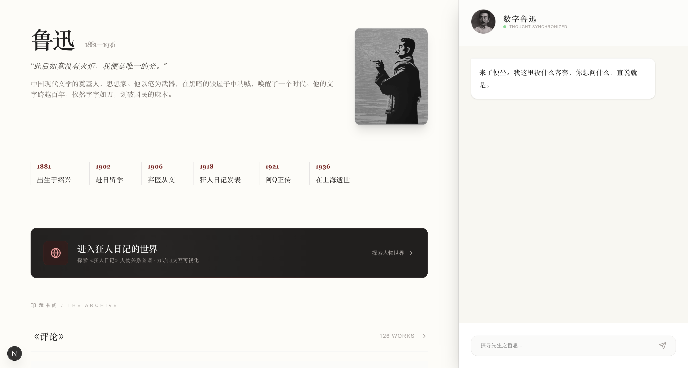
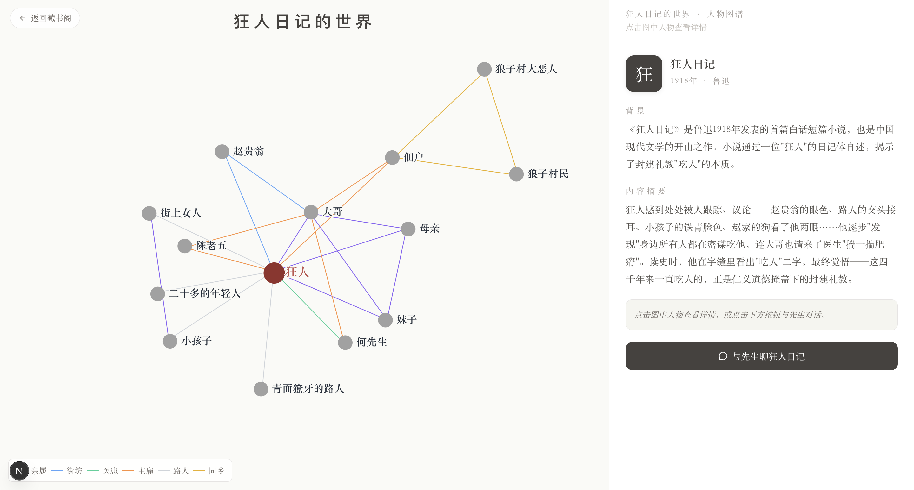

# 鲁迅数字宇宙 · Luxun Digital Universe

> "此后如竟没有火炬，我便是唯一的光。"

鲁迅先生（1881-1936）作品的数字化探索项目。将鲁迅的文学世界转化为可交互的数字体验——目前完成了《狂人日记》人物关系图谱和数字鲁迅对话功能。

---

## 页面展示

### 📖 首页 · 鲁迅全集藏书阁 + 数字鲁迅对话



左侧浏览鲁迅全部作品，右侧与"数字鲁迅"对话。作品卡片设有「进入XX的世界」入口，一键跳转到人物关系图谱。

### 🕸️ 狂人日记 · 人物关系图谱



基于 D3.js 力导向布局的交互式人物关系图。悬停高亮关联节点和连线，点击查看人物详情，底部可聊天。

---

## 功能

### 🕸️ 人物关系图谱

基于 **D3.js** 的力导向关系图谱，展示《狂人日记》的人物关系和事件网络。

- **力导向布局**：拖拽交互、缩放、人物浮移动画
- **关系过滤**：悬停高亮关联人物和关系线，无关节点变淡
- **人物详情**：点击节点查看性格、形象、经典语录、关联角色列表
- **图例**：六种关系类型以不同颜色区分
- **对话入口**：与鲁迅先生聊聊《狂人日记》

关系类型 | 颜色
---|---
亲属 | `#8B5CF6` 亮紫
街坊 | `#60A5FA` 亮蓝
医患 | `#34D399` 翠绿
主雇 | `#FB923C` 亮橙
路人 | `#D1D5DB` 浅灰
同乡 | `#EAB308` 亮黄

### 🤖 数字鲁迅对话

以鲁迅口吻回答问题的 AI 对话系统，基于 DeepSeek API。点击任意作品或图谱页的「与先生聊」按钮即可开始对话。

- 温和但尖锐的鲁迅文风，克制冷峻，偶尔冷幽默
- 对当代事物（手机、电脑、互联网）保持时代陌生感，借反差制造趣味
- 不自称 AI，不强行鸡汤，不卖惨
- 点破问题的同时给人出路

### 📚 鲁迅全集藏书阁

首页左侧按分类展示鲁迅全部作品，展开即可浏览每篇作品。点击作品可与鲁迅讨论创作背景和时代意义，也可打开全文阅读。

---

## 技术栈

| 层 | 技术 |
|---|---|
| **框架** | Next.js 16 (App Router, Turbopack) |
| **可视化** | D3.js v7 (力导向图) |
| **AI** | DeepSeek Chat API |
| **样式** | Tailwind CSS |
| **字体** | PingFang SC · Songti SC |
| **图标** | Lucide React |
| **数据** | SQLite → JSON (Python 脚本构建) |

---

## 本地运行

### 前置条件

- Node.js ≥ 18
- DeepSeek API Key（[获取](https://platform.deepseek.com/api_keys)）

### 安装与启动

```bash
# 1. 克隆仓库
git clone https://github.com/Siricvbl/luxun-digital-universe.git
cd luxun-digital-universe

# 2. 安装依赖
npm install

# 3. 配置环境变量
cp .env.example .env.local
# 在 .env.local 中填入：
# DEEPSEEK_API_KEY=your_deepseek_api_key_here

# 4. 启动开发服务器
npm run dev
```

访问 `http://localhost:3000`

### 数据构建（可选）

图谱数据已经预置在 `public/kr-graph-v7.json`。如需从数据库重新生成：

```bash
python scripts/build_db.py    # 从 SQLite 构建数据
python scripts/rewrite_v7.py  # 生成图谱 JSON
```

---

## 项目结构

```
app/
├── api/chat/route.ts        # 数字鲁迅对话 API
├── novel/[slug]/page.tsx    # 小说世界图谱页面
├── layout.tsx               # 全局布局
└── page.tsx                 # 首页（藏书阁 + 对话）

public/
├── kr-graph-v7.json         # 狂人日记图谱数据
├── screenshots/             # 页面截图
├── avatar.jpeg              # 鲁迅头像（聊天用）
└── portrait.jpeg            # 鲁迅肖像（首页展示）

docs/
├── ontology-design.md       # 本体论设计文档
└── relationship-ontology.md # 关系本体说明

scripts/
├── build_db.py              # 数据库构建
├── investigate.py           # 数据探查
├── rewrite_descriptions_v7.py  # 描述重写
└── rewrite_v7.py            # 图谱 JSON 生成
```

---

## 路线图

- [x] 鲁迅全集藏书阁（按分类浏览全部作品）
- [x] 数字鲁迅对话（鲁迅口吻 AI 问答）
- [x] 狂人日记人物关系图谱（D3.js 力导向图）
- [ ] 更多作品宇宙（阿Q正传、药、祝福……）
- [ ] Vercel 一键部署

---

## 许可

MIT
