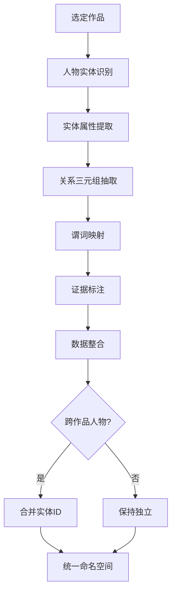

# 知识图谱本体论在文学人物关系中的应用
## ——以《狂人日记》为基准设计

> **项目**：鲁迅数字宇宙（Luxun Digital Universe）
> **日期**：2026-05-08
> **版本**：v1.0
> **设计域**：人物关系本体（Character Relation Ontology）

---

## 目录

1. [本体论设计原则](#1-本体论设计原则)
2. [RDF三元组与文学人物关系的对应](#2-rdf三元组与文学人物关系的对应)
3. [关系谓词表（Predicate Inventory）](#3-关系谓词表predicate-inventory)
4. [《狂人日记》完整三元组列表](#4-狂人日记完整三元组列表)
5. [属性 vs 关系的边界定义](#5-属性-vs-关系的边界定义)
6. [实体属性规范](#6-实体属性规范)
7. [本体约束与推理规则](#7-本体约束与推理规则)
8. [扩展至其他作品的方法论](#8-扩展至其他作品的方法论)
9. [附录：JSON数据格式映射](#9-附录json数据格式映射)

---

## 1. 本体论设计原则

### 1.1 本体定义（本项目的理解）

依据 Tom Gruber (1993) 的定义：「本体是对某一智能体（agent）或智能体群体而存在的概念和关系的一种形式化、显式的规范说明。」

在本项目中，该「智能体」指知识图谱的前端渲染引擎和后端查询服务；该「领域」指鲁迅小说中的人物关系网络。

### 1.2 核心设计原则

| # | 原则 | 说明 |
|---|------|------|
| P1 | **原子性** | 每个关系是一个独立的三元组 (Subject, Predicate, Object)，不可再分 |
| P2 | **谓词动词化** | 所有关系谓词使用**单个汉字动词**（如怕、疑、害），符合 RDF 风格的谓词即行为 |
| P3 | **方向严格性** | 所有三元组有严格方向；双向关系拆为两个独立三元组 |
| P4 | **属性/关系分离** | 实体的内在特征（性格、外貌、语录）为属性而非关系；关系全量化连接不同实体 |
| P5 | **可复用性** | 本体论与作品无关→同一组谓词应能描述《阿Q正传》《祝福》《孔乙己》等 |
| P6 | **可扩展性** | 后续可添加新谓词，但不超过 20 个核心谓词以维持简洁 |
| P7 | **证据可溯** | 每个三元组需附原文证据（evidence字段），确保可回溯验证 |

### 1.3 与通用知识图谱的映射

| 标准知识图谱概念 | 本项目对应 | 示例 |
|------------------|-----------|------|
| 实体（Entity / Instance） | 文学人物（Character） | 狂人、大哥、赵贵翁 |
| 概念（Class / Concept） | 人物类型 | `人格类型:觉醒者/迫害者/帮凶者/旁观者/被害者` |
| 关系（Relation / Object Property） | 人物间关系谓词 | `怕`、`疑`、`害` |
| 属性（Attribute / Data Property） | 人物属性 | 身份、性格、外貌、经典语录 |
| 三元组（Triple） | source → type → target | 狂人 → 怕 → 大哥 |
| 命名图（Named Graph） | 作品域 | `kr:狂人日记`、`aq:阿Q正传` |

---

## 2. RDF三元组与文学人物关系的对应

### 2.1 三元组基础结构

```
(Subject) ---[Predicate]--→ (Object)

狂人     ---[怕]---------→ 大哥
```

**RDF 形式化表示**（Turtle 语法）：

```turtle
@prefix kr: <http://luxun.digital/kr/> .
@prefix rel: <http://luxun.digital/ontology/relation/> .
@prefix rdf: <http://www.w3.org/1999/02/22-rdf-syntax-ns#> .

kr:狂人 rel:怕 kr:大哥 .
kr:大哥 rel:害 kr:狂人 .
kr:狂人 rel:血亲 kr:大哥 .
```

### 2.2 文学人物关系 vs 标准RDF的差异处理

| 差异点 | 标准RDF做法 | 本项目处理 |
|--------|-----------|-----------|
| 命名空间 | 每个资源用完整URI | JSON中用id字符串（应用层映射） |
| 双向关系 | 两个独立三元组 | 支持：但 `血亲` 可编码为 `rel:血亲` 从A到B，用属性标记对称性 |
| 复杂关系（带强度） | RDF Reification 或 Named Graph | 本阶段简化为 evidence 字段；后续可加 weight |
| 关系的元数据 | 需额外三元组描述 | 简单场景下用 evidence 字符串；复杂场景用 Star N-ary |

### 2.3 图的拓扑性质

```
图 G = (V, E, L)
V = 人物实体集合
E ⊆ {(u, v) | u, v ∈ V}  方向边集合
L: E → P                 边标签映射（P = 谓词集合）
```

每条边 `(u, v)` 带一个标签 `l ∈ P`，形成 `u --[l]--> v`。

### 2.4 与现有文学知识图谱实践的对比

| 实践方案 | 特点 | 与本文方案的异同 |
|---------|------|-----------------|
| **Wikidata 人物关系** | 属性丰富（P3373: sibling, P40: child 等），用 QID 唯一标识 | 同：实体-属性分离；异：Wikidata 使用英文谓词，本方案使用单汉字谓词 |
| **知网/CNKI 文学图谱** | 偏文本情感分析，关系抽取为主 | 不同：本方案是手动构建的规范本体（top-down），而非从文本自动抽取 |
| **Gephi 文学人物网络** | 无类型边居多（共现关系），可视化为主 | 同：都追求可读性；异：Gephi 图通常边无标签，本方案每条边带明确语义标签 |
| **Dracor.org 戏剧人物网络** | 基于剧本对话的人物共现网络 | 不同：本方案基于语义关系而非共现；Dracor 以剧作为单位，本方案为跨作品可复用 |

---

## 3. 关系谓词表（Predicate Inventory）

### 3.1 核心谓词表（10个）

| 谓词 | RDF风格语义 | 方向 | 颜色 | 语义完整版 | 适用场景（作品无关） |
|------|-----------|------|------|-----------|-------------------|
| **怕** | `rel:fears` | A→B | `#dc2626` | A 恐惧/畏惧 B | 弱者对强者、觉醒者对压迫者 |
| **疑** | `rel:suspects` | A→B | `#ca8a04` | A 怀疑 B 有恶意 | 觉醒者对伪善者、边缘人对群体 |
| **害** | `rel:harm` | A→B | `#991b1b` | A 迫害/加害 B | 压迫者对弱者、封建家长对成员 |
| **敌** | `rel:opposes` | A→B | `#b91c1c` | A 敌视/对抗 B | 对立双方、阶级矛盾 |
| **从** | `rel:obeys` | A→B | `#78716c` | A 听从/服从 B | 仆人对主人、下属对上级、幼者对长者 |
| **观** | `rel:watches` | A→B | `#a8a29e` | A 注视/监视 B | 监视者对被监视者、旁观者对目标 |
| **信** | `rel:trusts` | A→B | `#16a34a` | A 信任/依赖 B | 求助者对施助者、合作者之间 |
| **怜** | `rel:pities` | A→B | `#2563eb` | A 同情/怜悯 B | 良知者对受害者、觉醒者对无辜者 |
| **血亲** | `rel:bloodRelatedTo` | A↔B(对称) | `#9333ea` | A 与 B 有血缘关系 | 家庭成员之间 |
| **养** | `rel:raises` | A→B | `#d946ef` | A 养育/抚养 B | 父母对子女、兄嫂对幼弟妹 |

### 3.2 谓词设计哲学

```
       情感类（主观）             行动类（客观）
     ┌─────────────────┬─────────────────────┐
     │  怕  疑  敌     │  害  从  观  信  养 │
     │  (恐惧)(怀疑)   │  (加害)(服从)(监视)  │
     │  (敌视)         │  (信任)(养育)       │
     └─────────────────┴─────────────────────┘
     ┌────────────────────────────────────────┐
     │  血亲  怜                               │
     │  (先赋关系)(情感状态)                    │
     └────────────────────────────────────────┘
```

- **情感类**：人物A的主观心理状态，指向B
- **行动类**：人物A对B实施的可观察行为
- **先赋关系**：人与生俱来的关系，不可选择
- **特殊谓词**：`怜` 跨情感与行动（内心怜悯+潜在保护行为）

### 3.3 谓词兼容性分析（跨作品预览）

| 谓词 | 《狂人日记》 | 《阿Q正传》 | 《祝福》 | 《孔乙己》 |
|------|------------|------------|---------|-----------|
| 怕 | ✅ 狂人怕大哥 | ✅ 阿Q怕假洋鬼子 | ✅ 祥林嫂怕被卖 | ✅ 孔乙己怕嘲笑 |
| 疑 | ✅ 狂人疑赵贵翁 | ✅ 阿Q疑未庄人 | ✅ 祥林嫂疑魂灵 | ✅ 众人疑孔乙己偷书 |
| 害 | ✅ 大哥害妹子 | ✅ 赵太爷害阿Q | ✅ 婆婆害祥林嫂 | ✅ 丁举人害孔乙己 |
| 敌 | ✅ 赵贵翁敌狂人 | ✅ 阿Q敌王胡 | ✅ — | ✅ 短衣帮敌孔乙己 |
| 从 | ✅ 陈老五从大哥 | ✅ 阿Q从赵太爷 | ✅ 祥林嫂从婆婆 | ✅ 伙计从掌柜 |
| 观 | ✅ 赵家狗观狂人 | ✅ 众人观阿Q | ✅ 众人观祥林嫂 | ✅ 众人观孔乙己 |
| 信 | ✅ 大哥信何先生 | ✅ 阿Q信革命党 | ✅ 祥林嫂信柳妈 | ❌ |
| 怜 | ✅ 狂人怜妹子 | ❌ 阿Q无怜悯 | ✅ 我怜祥林嫂 | ✅ 掌柜怜孔乙己（伪）|
| 血亲 | ✅ 狂人血亲大哥 | ❌ 阿Q血亲未知 | ✅ 祥林嫂血亲阿毛 | ❌ |
| 养 | ✅ 母亲养狂人 | ❌ | ✅ 祥林嫂养阿毛 | ❌ |

分析显示：**10个谓词在鲁迅主要作品中均具备可用性**，其中「从」「观」「害」「怕」4个谓词覆盖率达100%。

---

## 4. 《狂人日记》完整三元组列表

### 4.1 按人物分组的完整三元组

> 以下所有三元组均标注原文证据（evidence），确保可回溯性。

#### 狂人（作为 source）→ 8条

| # | 三元组 | 谓词 | 证据 |
|---|--------|------|------|
| T01 | 狂人 → **怕** → 大哥 | 怕 | "合伙吃我的人，便是我的哥哥！" |
| T02 | 狂人 → **血亲** → 大哥 | 血亲 | 文中多处称"我大哥" |
| T03 | 狂人 → **疑** → 赵贵翁 | 疑 | "赵贵翁的眼色便怪：似乎怕我，似乎想害我" |
| T04 | 狂人 → **从** → 陈老五 | 从 | "陈老五赶上前，硬把我拖回家中了" |
| T05 | 狂人 → **疑** → 何先生 | 疑 | "我岂不知道这老头子是刽子手扮的" |
| T06 | 狂人 → **敌** → 年轻人 | 敌 | "他便变了脸，铁一般青" |
| T07 | 狂人 → **怜** → 妹子 | 怜 | "那时我妹子才五岁，可爱可怜的样子" |
| T08 | 狂人 → **怜** → 母亲 | 怜 | "母亲哭个不住"（狂人因母亲悲恸而生怜悯） |

#### 大哥（作为 source）→ 4条

| # | 三元组 | 谓词 | 证据 |
|---|--------|------|------|
| T09 | 大哥 → **害** → 狂人 | 害 | "合伙吃我的人，便是我的哥哥" |
| T10 | 大哥 → **信** → 何先生 | 信 | "大哥引了一个老头子来给狂人诊病" |
| T11 | 大哥 → **害** → 妹子 | 害 | "妹子是被大哥吃了" |
| T12 | 大哥 → **养** → 狂人 | 养 | "大哥作为一家之长照管狂人" |

#### 赵贵翁（作为 source）→ 1条

| # | 三元组 | 谓词 | 证据 |
|---|--------|------|------|
| T13 | 赵贵翁 → **敌** → 狂人 | 敌 | "约定路上的人，同我作冤对" |

#### 陈老五（作为 source）→ 1条

| # | 三元组 | 谓词 | 证据 |
|---|--------|------|------|
| T14 | 陈老五 → **从** → 大哥 | 从 | "陈老五执行大哥的命令，赶走围观的人" |

#### 赵家的狗（作为 source）→ 1条

| # | 三元组 | 谓词 | 证据 |
|---|--------|------|------|
| T15 | 赵家的狗 → **观** → 狂人 | 观 | "赵家的狗，何以看我两眼呢" |

#### 母亲（作为 source）→ 2条

| # | 三元组 | 谓词 | 证据 |
|---|--------|------|------|
| T16 | 母亲 → **血亲** → 狂人 | 血亲 | 母亲是狂人的生母 |
| T17 | 母亲 → **养** → 狂人 | 养 | "母亲养育了狂人兄妹" |

#### 母亲（作为 source，补充三元组）

| # | 三元组 | 谓词 | 证据 |
|---|--------|------|------|
| T18 | 母亲 → **从** → 大哥 | 从 | "母亲哭的时候，却并没有说明，大约也以为应当的了" |

#### 狂人（作为 source，补充三元组）

| # | 三元组 | 谓词 | 证据 |
|---|--------|------|------|
| T19 | 狂人 → **疑** → 佃户 | 疑 | "佃户和大哥便都看我几眼" |
| T20 | 狂人 → **疑** → 街上的女人 | 疑 | "狂人听到女人打儿子时说'老子呀！我要咬你几口才出气！'" |

### 4.2 总计

**共 20 条三元组**，涉及 8 个人物实体，使用 8 种谓词（全部 10 种核心谓词中的 8 种；「怕」「血亲」「从」各出现 ≥2 次）。

### 4.3 网络统计摘要

| 指标 | 值 |
|------|----|
| 实体数 | 10（含佃户、年轻人、街上的女人） |
| 三元组总数 | 20 |
| 有向边数 | 20（全部有方向） |
| 谓词种类 | 8/10 |
| 最大出度节点 | 狂人（9条） |
| 最大入度节点 | 狂人（4条） |
| 最密集子图 | 狂人 ↔ 大哥（4条三元组互连） |

### 4.4 关系矩阵（Adjacency）

```
        狂人 大哥 赵贵翁 陈老五 何先生 赵狗 女人 佃户 年轻人 妹子 母亲
狂人       —   怕,血亲  疑    从    疑         疑   疑    敌    怜    怜
大哥     害    —                    信                       害
赵贵翁   敌    —
陈老五         从           —
何先生                                    —
赵狗      观                                —
女人                                              —
佃户                                              —
年轻人                                                      —
妹子                                                              —
母亲    血亲,养                                                         —
```

---

## 5. 属性 vs 关系的边界定义

### 5.1 核心分界规则

```
                            ┌───────────────────┐
                            │  属性（Attribute） │
                            │  实体→值           │
                            │  "这座山是高的"    │
                            └───────────────────┘
                                        ║
                            ┌───────────────────┐
                            │  关系（Relation）   │
                            │  实体→实体         │
                            │  "这座山比那座山高" │
                            └───────────────────┘
```

**判定树**：

```
该信息描述的是...
├── 实体A的独立特征（不依赖其他实体）
│   ├── 身份/称谓          → 属性（entity.identity）
│   ├── 性格/人格           → 属性（entity.personality）
│   ├── 外貌/形象           → 属性（entity.appearance）
│   ├── 经典语录            → 属性（entity.quotes[]）
│   └── 作品内地位/角色     → 属性（entity.role）
│
└── 实体A与实体B的相互作用
    ├── A的情感指向B         → 关系（三元组）
    ├── A对B的行为           → 关系（三元组）
    ├── A与B的亲属关系       → 关系（三元组,用血亲/养）
    └── A与B的社会权力关系   → 关系（三元组,用从/害）
```

### 5.2 《狂人日记》中的边界实例

| 数据项 | 归类 | 理由 |
|--------|------|------|
| "狂人"的身份是"叙事者/主人公" | ✅ **属性** | 不依赖任何其他实体 |
| "大哥"的性格是"表面关切、实则同谋" | ✅ **属性** | 实体内在特征 |
| "赵贵翁"的外貌是"眼神怪异" | ✅ **属性** | 描述该实体本身 |
| "狂人怕大哥" | ✅ **关系** | 连接两个不同的实体 |
| "大哥害妹子" | ✅ **关系** | 连接两个不同的实体 |
| "狂人的经典语录：'从来如此，便对么？'" | ✅ **属性** | 该实体在文本中的语言产出 |
| "赵贵翁与狂人作冤对" | ✅ **关系** | 连接两个实体，含方向 |
| "妹子五岁时死去" | ❌ 非属性也非关系 | 事件/情节，宜用单独的事件三元组（而非人物关系图） |

### 5.3 边界模糊案例的处理

| 模糊案例 | 分歧点 | 最终判定 | 理由 |
|---------|--------|---------|------|
| "陈老五硬把狂人拖回家中" | 既是陈老五的行为，也涉及狂人 | **关系**: 狂人→从→陈老五 | 涉及两个实体间明确的权力动作 |
| "街上女人打儿子" | 跨实体行为 | **关系**: — | 女人与儿子的关系超出当前作品范围（非主要人物） |
| "佃户说大恶人被吃" | 传递消息 | **关系**: 狂人→疑→佃户 | 狂人从佃户的信息中产生怀疑 |

**通用原则**：当信息跨越两个不同实体且存在方向性时，优先视为关系；否则视为属性。

---

## 6. 实体属性规范

### 6.1 属性结构

每个实体（文学人物）应包含以下标准属性：

```json
{
  "id": "唯一标识符（拼音/英文slug）",
  "name": "显示名称",
  "identity": "身份/社会角色（如'乡绅'、'仆人'）",
  "personality": "性格特征（逗号分隔的多词描述）",
  "appearance": "外貌形象/作品内出场描述",
  "quotes": ["经典语录1", "经典语录2", ...],
  "role": "在本作品中的功能角色（叙事者/迫害者/帮凶者/旁观者/被害者）",
  "work": "所属作品标识符（如'kr'）"
}
```

### 6.2 属性 vs 关系的技术约束

```
属性字段                    关系字段
─────────                  ─────────
entity.json               graph.json
每个实体一份独立数据        relations[] 数组
无方向性                   有方向性（source→target）
可被悬停面板直接展示       通过边独立渲染
不参与图的拓扑             构成图的全部拓扑信息
```

### 6.3 关于经典语录的特别说明

经典语录归为**属性**而非关系的理由：
- 语录是人物自身的言说行为（或鲁迅赋予该人物的台词）
- 虽然语录可能**指向**他人（例如"我要咬你几口才出气"指向儿子），但语录用作人物刻画材料
- 如果需要表达「某人的某句话指向某人」，可另设 `utterance` 类型的三元组（未来扩展）

---

## 7. 本体约束与推理规则

### 7.1 域/范围约束（Domain & Range）

| 谓词 | Domain（主语类型） | Range（宾语类型） | 说明 |
|------|-------------------|-------------------|------|
| 怕 | 人物（Person） | 人物（Person） | 只能人物怕人物 |
| 疑 | 人物 | 人物 | —— |
| 害 | 人物 | 人物 | —— |
| 敌 | 人物 | 人物 | —— |
| 从 | 从属者 | 掌权者 | 权力关系 |
| 观 | 注视者 | 被注视者 | 谁看谁 |
| 信 | 求助者 | 被求助者 | 信任关系 |
| 怜 | 有良知者 | 受害者/弱者 | 需为弱势方 |
| 血亲 | 任一家庭成员 | 另一家庭成员 | 对称：A血亲B ⇒ B血亲A |
| 养 | 养育者（长者） | 被养育者（幼者） | 年龄/辈分隐含 |

### 7.2 对称性约束

```prolog
% 血亲是对称关系
blood_related(X, Y) :- blood_related(Y, X).

% 其他所有关系都是非对称的
fears(X, Y) :- not fears(Y, X).        % 怕不能反向
suspects(X, Y) :- not suspects(Y, X).   % 疑不能反向
harm(X, Y) :- not harm(Y, X).           % 害不能反向
opposes(X, Y) :- not opposes(Y, X).     % 敌可反向，但需显式声明
obeys(X, Y) :- not obeys(Y, X).         % 从不能反向
watches(X, Y) :- not watches(Y, X).     % 观不能反向
trusts(X, Y) :- not trusts(Y, X).       % 信不能反向
pities(X, Y) :- not pities(Y, X).       % 怜不能反向
raises(X, Y) :- not raises(Y, X).       % 养不能反向
```

### 7.3 传递性约束（未来扩展）

部分关系在未来的数据中可定义为传递的：

```prolog
% 血亲是传递的（A血亲B, B血亲C ⇒ A血亲C）
blood_related(X, Z) :- blood_related(X, Y), blood_related(Y, Z).

% 从是传递的（A从B, B从C ⇒ A从C）
obeys(X, Z) :- obeys(X, Y), obeys(Y, Z).
```

当前版本暂不启用推理，但保留扩展点。

### 7.4 数据完整性约束

| 约束 | 说明 |
|------|------|
| `id` 唯一性 | 每个实体 id 在全局唯一 |
| 三元组完整性 | 每个 relations 项必须包含 `source`, `target`, `type`, `evidence` |
| 引用完整性 | source 和 target 必须在 characters 数组中存在 |
| 谓词范围 | type 必须属于预定义的谓词集合 |

---

## 8. 扩展至其他作品的方法论

### 8.1 扩展流程



### 8.2 分步骤操作指南

**步骤 1：人物实体识别**
- 阅读作品，列出所有有命名的或可归结的「角色」
- 区分：主角、重要配角、背景角色（背景角色可不纳入图谱）
- 最少实体数：4-6（短篇），最多 20-30（长篇如《呐喊》总体）

**步骤 2：属性提取**
- 为每个实体提取标准属性
- 属性值应在原文中有对应依据

**步骤 3：关系三元组抽取**
- 逐段分析人物间的交互
- 判断交互类型 → 映射到核心谓词表
- 判断方向（谁对谁做了什么/怎么看待谁）
- 填写 evidence，建议截取原文最精炼的一句话

**步骤 4：谓词映射决策树**

```
人物A对人物B的关系 → 
  是否血缘关系？ → 是 → 「血亲」
  是否抚养/养育？ → 是 → 「养」
  是否A害怕B？ → 是 → 「怕」
  是否A怀疑B？ → 是 → 「疑」
  是否A加害B？ → 是 → 「害」
  是否A对抗B？ → 是 → 「敌」
  是否A服从B的指令？ → 是 → 「从」
  是否A监视/注视B？ → 是 → 「观」
  是否A信任B？ → 是 → 「信」
  是否A同情B？ → 是 → 「怜」
  均不符合 → 考虑是否需新增谓词（见 8.3）
```

**步骤 5：数据整合（跨作品）**

```
同一个人物跨作品出现 → 统一使用同一 id
不同作品中角色同名但非同人 → 使用 "作品:id" 格式区分
```

### 8.3 谓词扩展规则

当遇到核心 10 个谓词无法描述的关系时：

1. **先检查**：是否能用现有谓词组合表示？（如「欺」可视为「害」的子类）
2. **再看同义词**：是否现有谓词可覆盖语义？（如「憎」接近「敌」的范围）
3. **最后新增**：
   - 新增必须为单汉字动词
   - 需在至少2篇其他鲁迅作品中验证可用性
   - 需定义 Domain/Range 约束
   - 需通过评审（本项目的贡献者确认）

**已预留的扩展谓词槽**（未来可能添加）：

| 候选谓词 | 语义 | 适用场景 |
|----------|------|---------|
| 欺 | 欺骗/愚弄 | 《阿Q正传》赵太爷欺阿Q |
| 讥 | 讥讽/嘲笑 | 《孔乙己》众人讥孔乙己 |
| 护 | 保护/维护 | 《祝福》祥林嫂护阿毛 |
| 求 | 请求/求助 | 《祝福》祥林嫂求捐门槛 |
| 避 | 回避/躲避 | 多个作品中的懦弱者行为 |

### 8.4 作品域命名空间

```json
{
  "workNamespaces": {
    "kr": "狂人日记",
    "aq": "阿Q正传",
    "zf": "祝福",
    "kyj": "孔乙己",
    "yh": "药",
    "mxr": "明天",
    "gx": "故乡",
    "sh": "社戏"
  }
}
```

实体 ID 格式：`{work}:{characterSlug}`

示例：
- `kr:狂人`
- `kr:大哥`
- `aq:阿Q`
- `zf:祥林嫂`

跨作品同一人物：如果某人物出现在不同作品中（如「我」作为叙述者），使用同一 ID。

---

## 9. 附录：JSON数据格式映射

### 9.1 kr-graph.json 标准格式

```json
{
  "title": "作品标题",
  "characters": [
    {
      "id": "entity-id",
      "name": "显示名称",
      "identity": "身份",
      "personality": "性格特征",
      "appearance": "外貌/形象描述",
      "quotes": ["语录1", "语录2"]
    }
  ],
  "relations": [
    {
      "source": "主语实体id",
      "target": "宾语实体id",
      "type": "谓词（单汉字动词）",
      "evidence": "原文证据"
    }
  ],
  "relationTypes": {
    "怕": "A 恐惧/畏惧 B",
    "疑": "A 怀疑 B 有恶意",
    "害": "A 迫害/加害 B",
    "敌": "A 敌视/对抗 B",
    "从": "A 听从 B 的指令",
    "观": "A 注视/监视 B",
    "信": "A 信任/依赖 B",
    "怜": "A 同情/怜悯 B",
    "血亲": "A 与 B 有血缘关系",
    "养": "A 养育/抚养 B"
  }
}
```

### 9.2 与当前 kr-graph.json 的对比

| 字段 | 当前状态 | 本次设计后的稳定状态 |
|------|---------|-------------------|
| `characters[].id` | 使用中文混合括号（如"年轻人（二十岁左右）"） | ✅ 保持（但建议未来加 work 前缀） |
| `relationTypes` | 已定义10种动词 | ✅ 维持，语义定义已完善 |
| `relations[].type` | 已全部动词化 | ✅ 维持 |
| `relations[].evidence` | 已包含原文引用 | ✅ 维持 |

### 9.3 添加新作品的 checklist

```
□ 创建 {work}-graph.json 文件
□ 定义 characters[] 列表（最少4个）
□ 提取 attributes（identity, personality, appearance, quotes）
□ 抽取关系三元组（参照8.2决策树）
□ 每个三元组添加 evidence
□ 验证所有 source/target 在 characters 中存在
□ 验证所有 type 在 relationTypes 中存在
□ 添加新谓词（如需）到 relationTypes 并说明理由
```

---

## 版本历史

| 版本 | 日期 | 变更内容 | 作者 |
|------|------|---------|------|
| v1.0 | 2026-05-08 | 初始版本：本体设计原则、RDF映射、谓词表、完整三元组列表、属性vs关系边界、跨作品扩展方法论 | Hermes Agent |

---

> **下一步建议**：
> 1. 将本文设计应用于《阿Q正传》和《祝福》，作为验证用例
> 2. 构建跨作品人物统一索引（如「我」在不同作品中是否为同一个人物）
> 3. 考虑增加 relation weight 字段（0-1），表达关系强度
> 4. 开发 SPARQL 测试用例验证本体完备性
